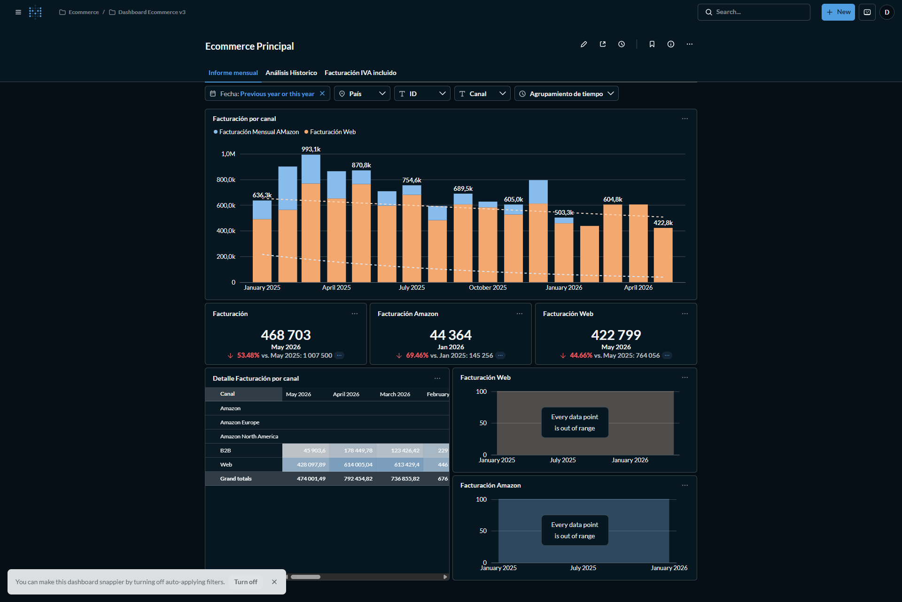
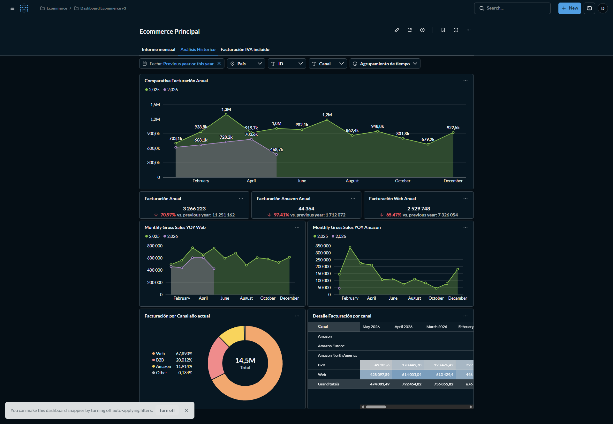
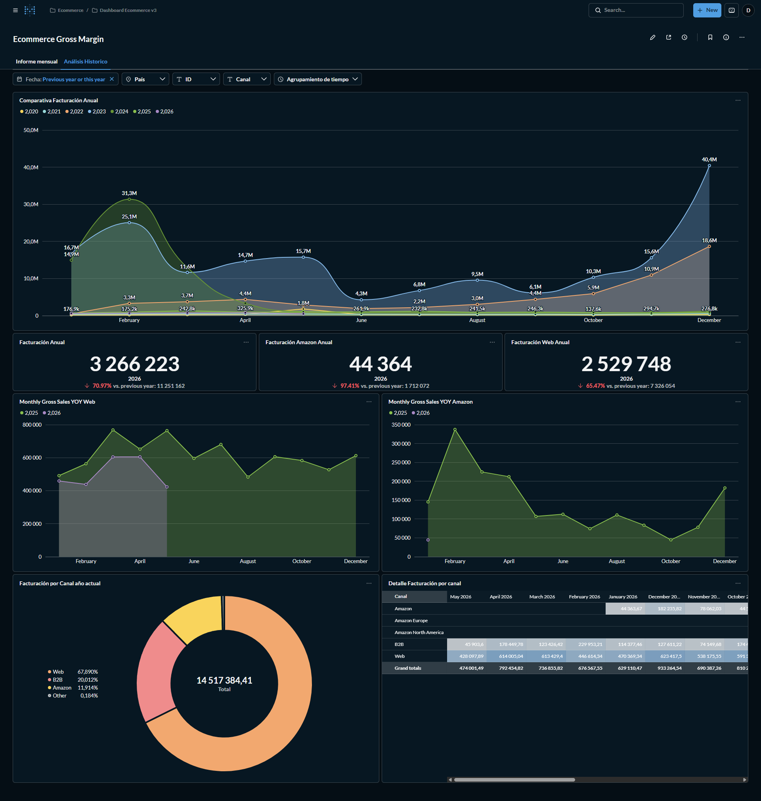
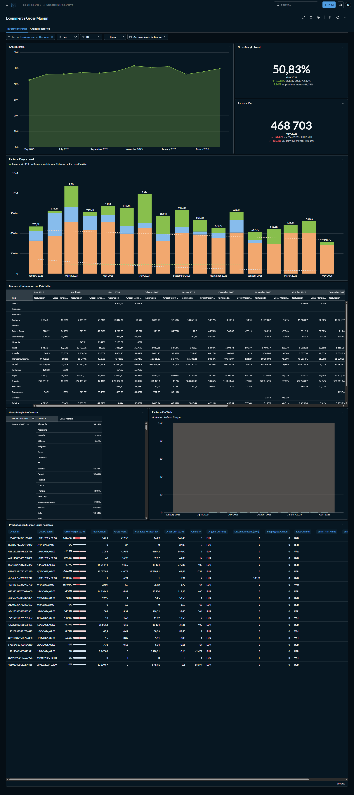
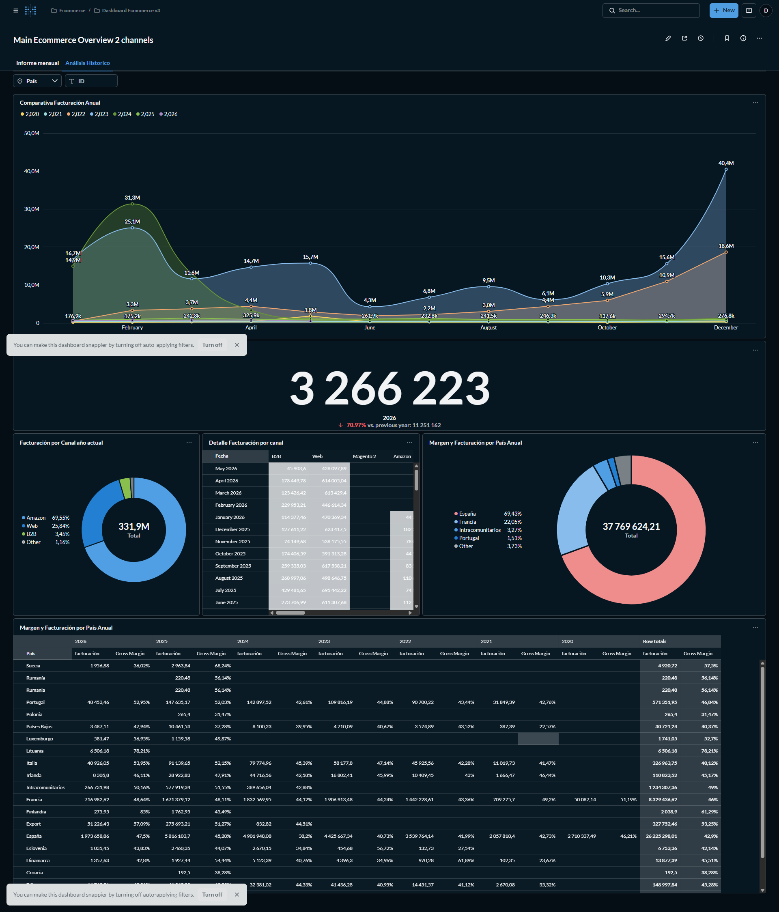
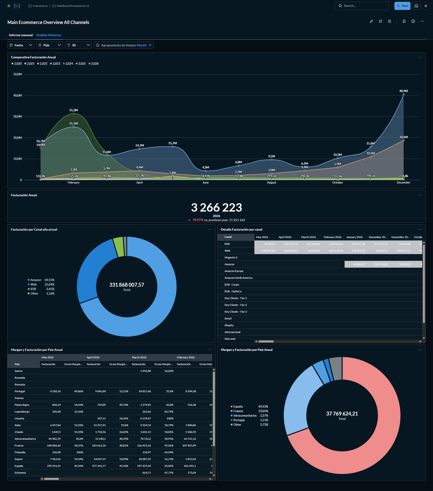
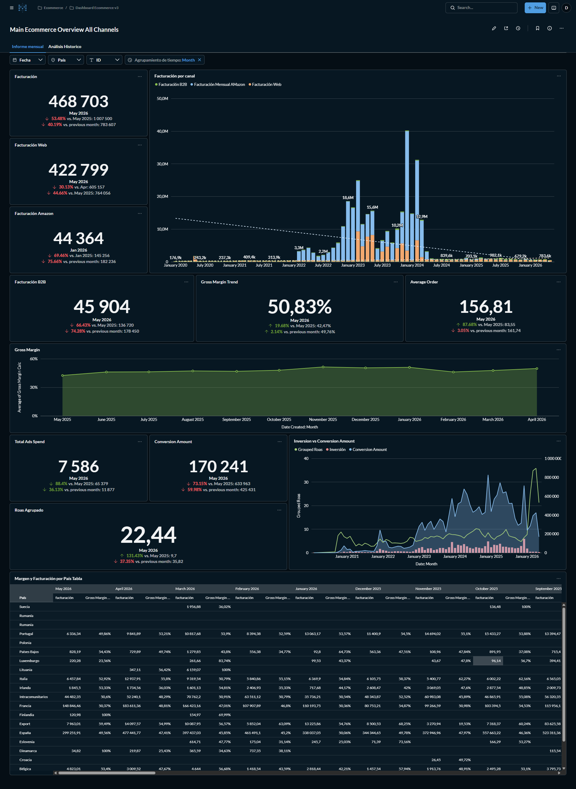

# 📊 E-Commerce Marketing Performance Dashboard — Metabase

> A multi-dashboard **Metabase** reporting suite built on a PostgreSQL backend — giving a European e-commerce client a single live view of revenue, gross margin, channel performance, and ad spend across Amazon, Web, and B2B channels.

---

## 📌 Project Overview

The client was running a multi-channel e-commerce operation across Amazon, their own web store, and B2B accounts — with revenue data living in a PostgreSQL backend and ad performance sitting separately in their ad platforms. There was no consolidated view connecting sales outcomes to channel activity, and no way to track margin at scale.

I built a suite of Metabase dashboards using custom SQL queries directly on their PostgreSQL database. The result: a fully interactive reporting system covering revenue trends, gross margin by country, channel mix, YoY comparisons, and ad spend efficiency — all filterable by date, country, channel, and time grouping.

**Language:** Spanish (client-facing dashboard)
**Stack:** Metabase · PostgreSQL · Custom SQL
**Channels tracked:** Amazon (EU + NA) · Web · B2B · Magento 2 · Retail

---

## 📄 Dashboard Suite

### 1. Ecommerce Principal — Monthly Revenue by Channel

The main operational dashboard. Tracks monthly revenue split between Amazon and Web, with MoM and YoY comparisons for each channel. Includes a detailed breakdown table by channel and interactive filters for date range, country, product ID, channel, and time grouping.





**Key metrics visible:**
- Total revenue (Facturación): **468,703** — May 2026
- Amazon revenue: **44,364** | Web revenue: **422,799**
- Monthly stacked bar chart comparing Amazon vs Web across 18 months
- Channel-level revenue table with month-by-month columns

---

### 2. Ecommerce Gross Margin — Margin Analysis Dashboard

A dedicated profitability view. Tracks gross margin percentage over time, breaks it down by country and channel, and surfaces products with negative margin for immediate action.





**Key metrics visible:**
- Current gross margin: **50.83%** (May 2026) — up from 42.47% same month prior year
- 6-year historical gross margin trend (2020–2026) across all channels
- Margin and revenue table broken down by country (Spain, France, Italy, Portugal, and more)
- Negative margin product drill-down table with order-level detail

---

### 3. Main Ecommerce Overview — 2 Channels

A strategic summary dashboard combining Web and Amazon performance with YoY comparisons going back to 2020. Designed for leadership-level review of total business trajectory.



**Key metrics visible:**
- Annual revenue (Facturación Anual): **3,266,223** — 2026
- Channel mix: Amazon 69.55% · Web 25.84% · B2B 3.45% · Other 1.16%
- Total lifetime revenue across all tracked years: **331.9M**
- Country margin table: Spain, France, Italy, Portugal, Netherlands, and more

---

### 4. Main Ecommerce Overview — All Channels

The most comprehensive view in the suite. Adds full channel granularity (B2B sub-tiers, Magento 2, Retail, Shopify, Key Clients by tier) and integrates ad spend data — connecting revenue outcomes to marketing investment.






**Key metrics visible:**
- Total ad spend: **7,586** · Conversions: **170,241** · Grouped ROAS: **22.44**
- Gross Margin Trend: **50.83%** — sustained upward trend across 12 months
- Average order value: **156.81**
- Full channel breakdown: B2B-Corpo, B2B-HoReCa, Key Clients Tier 1/2/3, Retail, Shopify, Internacional
- Ad spend vs conversion chart going back to January 2021

---

## 🛠️ How It Was Built

| Layer | Detail |
|---|---|
| **Data source** | PostgreSQL backend database |
| **BI tool** | Metabase (hosted) |
| **Query method** | Custom SQL for each card and dashboard |
| **Filters** | Date range · Country · Channel · Product ID · Time grouping |
| **Comparisons** | MoM · YoY · vs. same month prior year |
| **Dashboard language** | Spanish (client-facing) |

---

## 💡 What This Replaced

Before this dashboard suite, the team was reviewing weekly spreadsheet exports with no live data, no channel comparison, and no margin visibility at country level. The dashboards consolidate all of that into a single Metabase environment updated daily — giving the team the ability to move from a top-level revenue number down to the individual order or product behind it.

---

## 📁 Dashboard Structure

```
Dashboard Ecommerce v3/
├── Ecommerce Principal          # Monthly revenue by channel (operational)
├── Ecommerce Gross Margin       # Profitability & margin analysis
├── Main Overview – 2 Channels   # Strategic YoY summary (Amazon + Web)
└── Main Overview – All Channels # Full channel + ad spend view
```

---

## 👤 About

Built by **[Md Arshad Ahammed (Ash)](https://arshadadvisory.com)** — Marketing Performance Analyst specialising in Metabase, SQL, Looker Studio, GA4, and marketing analytics.

📬 [arshadadvisory.com](https://arshadadvisory.com)
